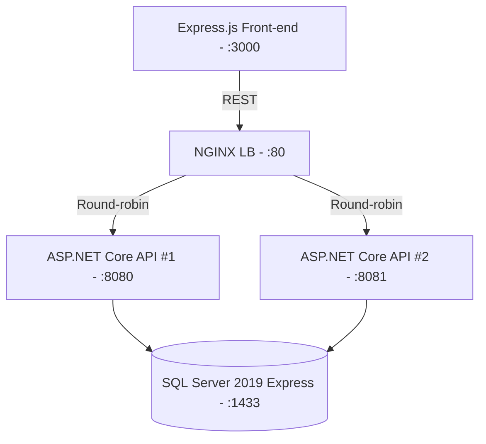

# Cloud‑Project – Load‑Balanced Full‑Stack Demo  

A portfolio‑ready sample that shows how to build, containerise and horizontally scale a small **.NET 8 + SQL Server** backend behind **NGINX** while serving a slick **Node/Express** front‑end – all orchestrated with **Docker Compose**.

---
## ✨ Why this project matters
* **Real‑world stack** that mirrors typical production setups (API replicas, shared DB, reverse proxy, front‑end).
* Demonstrates **horizontal scaling** & **zero‑downtime deployments** via round‑robin load‑balancing.
* Shows clean **CI‑ready Dockerfiles** for both .NET 8 and Node 18 images.
* Uses **EF Core automatic migrations** so the database is provisioned on first boot.
* Fits in a single `docker compose up` – perfect for recruiters reviewing code quickly.

---
## 🏗️ Architecture at a glance


---
## 📦 Service Breakdown
| Service | Image / Base | Port | Key Responsibilities |
|---------|--------------|------|----------------------|
| **frontend** | `node:18` | 3000 | Renders HTML & calls `/api/users` |
| **backend1 / backend2** | `mcr.microsoft.com/dotnet/aspnet:8.0` | 8080 / 8081 | CRUD Users; exposes hostname so you can see which replica served the request |
| **sqlserver** | `mcr.microsoft.com/mssql/server:2019` | 1433 | Persistence layer, seeded by EF Core |
| **nginx** | `nginx:latest` | 80 | Reverse proxy + load balancer |

---
## 🛠️ Tech Stack
* **C# /.NET 8**, **Entity Framework Core** (code‑first, migrations)
* **Node 18**, **Express 4**
* **SQL Server 2019 Express**
* **NGINX** (round‑robin `upstream` blocks)
* **Docker Compose v3.8**

---
## 🚀 Getting Started Locally
```bash
# 1. Clone repo
$ git clone https://github.com/<your‑handle>/cloud‑project.git
$ cd cloud‑project

# 2. Spin up entire stack
$ docker compose up --build -d

# 3. Visit the front‑end
➜ http://localhost (lists users & shows which API replica responded)
```
The first boot will apply EF Core migrations automatically and create `Db` inside the SQL Server container.

### Tear down
```bash
$ docker compose down -v   # removes containers + named volumes
```

---
## 🧑‍💻️ Typical Workflow
1. **Add code** in `backend/` or `frontend/`.
2. Re‑build the affected image, e.g. `docker compose build backend1 backend2`.
3. Zero‑downtime deploy – NGINX keeps routing while new containers start.

---
## 📑 API Reference
* **GET /api/users** → array of users + `server` field (hostname of serving container)
* **POST /api/users** `{ name: string }` → newly created user + `server`

> Swagger UI is available when `ASPNETCORE_ENVIRONMENT=Development` (default inside containers).

---
## 🖼️ Sample Response
```json
{
  "users": [ { "id": 1, "name": "Alice" } ],
  "server": "marchuk-bohdan-io-41mn-backend1"
}
